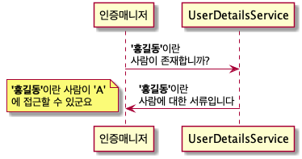

# 8. Spring Web Security
- 사용자의 권한에 따른 URI 접근 제어
- 데이터베이스와 연동하는 로그인 처리
- 쿠키를 이용한 자동 로그인(rememeber-me)
- 패스워드 암호화

> 인증(Authentication): 인증 절차를 거쳐 증명하는 것
> 인가(Authorization): 권한 부여나 허가와 같은 의미

## 1. 예제 프로젝트 생성
사용자와 사용자의 권한을 관리한ㄴ 기능과 해당 기능을 이용해서 스프링 시큐리티를 적용하는 부분으로 구성

1. 프로젝트 생성
   - Security
   - DevTools
   - Lombok
   - JPA
   - MyBatis
   - MySQL
   - Thymeleaf
   - Web

2. `application.properties` 수정

### 시큐리티의 기본 설정 추가하기
1. SecurityConfig 클래스 추가
2. 빈 등록을 위해 `@EnableWebSecurity` 어노테이션 추가
3. 설정을 담당하는 `WebSecurityConfigurerAdapter` 클래스 상속
4. `configure(HttpSecurity http)` 메서드 오버라이드

### 샘플 URI 생성
1. SampleController 를 생성
2. templates 파일들 생성
  - guest.html
  - manager.html
  - admin.html
  - index.html

## 2. 회원과 권한 설계
Spring Data JPA를 이용해서 서비스를 이용하는 회원과 각 회원이 가지는 권한을 생성

회원에 대한 용어는 Member를 이용
회원(Member)은 등급이나 권한을 가지도록 설계
스프링 시큐리티에서 User라는 용어를 사용함

프로젝트에서 작성하는 수준은 특정한 회원(Member)이 특정한 권한(MemberRole)을 가진다고 가정하고
특정 URL에 대해서 이를 체크하도록 함

### 도메인 클래스 설계
Member 와 MemberRole 클래스를 생성
- Member: uid, upw, uname
- MemberRole: fno, roleName

속성을 가지도록 설계
스프링 시큐리티에서 username, password 등의 용어를 사용

#### 연관관계의 설정
- Member와 MemberRole은 '일대다', '다대일'의 관계
- MemberRole 자체가 단독으로 생성되는 경우는 거의 없으므로, Member가 MemberRole을 관리하는 방식의 설계

### Repository 생성
MemberRepository 생성

### 테스트를 통한 데이터 추가/조회
1. 테스트 클래스인 MemberTests 클래스 생성
2. 데이터 추가 코드
3. testInsert() 100명의 사용자 생성
4. 사용자 중 user0 부터 user80까지는 'BASIC'이라는 권한
   user90까지는 'MANAGER' 나머지 10명은 'ADMIN' 권한을 가지도록 설계

> Member 엔티티와 MemberRole 엔티티를 동시에 저장해서 에러가 발생  
> 이에 대한 처리로 cascade 설정을 추가

5. 회원 데이터와 함께 권한들에 대한 정보를 같이 조회할 수 있도록 조회 작업 진행

> tbl_members와 tbl_member_roles 테이블을 둘 다 조회해야 하기 때문에  
> 트랜잭션 처리를 해주거나 즉시 로딩을 이용해서 조인을 하는 방식으로 처리
> fetch 모드를 즉시 로딩으로 설정

## 3. 단순 시큐리티 적용
https://spring.io/guides/topicals/spring-security-architecture
웹에서 스프링 시큐리티는 기본적으로 필터 기반으로 동작
내부에는 상당히 많은 종류의 필터들이 이미 존재하므로 개발 시 필터들의 설정을 조정하는 방식을 주로 사용

### 로그인/로그아웃 관련 처리
#### 특정 권한을 가진 사람만이 특정 URI에 접근하기
SecurityConfig 클래스에는 configure() 메소드를 이용해서 웹 자원에 대한 보안을 확인  
HttpSecurity는 웹과 관련된 다양한 보안설정을 걸어줄 수 있음

특정한 경로에 특정한 권한을 가진 사용자만 접근할 수 있도록 설정
- authorizeRequests(): 시큐리티 처리에 HttpServletRequest를 이용한다는 것을 의미
- antMatches(): 특정한 경로를 지정
  - permitAll(): 모든 사용자가 접근할 수 있음
  - hasRole(): 시스템상에서 특정 권한을 가진 사람만이 접근할 수 있음

'/guest', '/manager'로 접근 테스트 '/manager'은 Access Denied' 메세지 출력

#### 로그인 페이지 보여주기
'/login'으로 접근해 권한을 인가 받도록 configure() 수정

`formLogin()`: form 태그 기반의 로그인을 지원하겠다는 설정

스프링 시큐리티에서 기본 로그인 화면 제공

#### 로그인 정보 설정하기
로그인 처리를 위해 SecurityConfig에 AuthenticationManagerBuilder를 주입해서 인증 처리

#### 로그인 관련 정보 삭제하기
개발자 도구 -> Application 탭 -> Cookies 쿠키 확인  
Cookies 메뉴에서 Clear로 브라우저 종료

#### 커스텀 로그인 페이지 만들기
1. `formLogin()` 이후 `loginPage()` 메소드를 이용해서 URI 지정
2. LoginController 클래스 생성
3. templates 폴더 내에 login.html 작성
   스프링 시큐리티는 기본적으로 username과 password라는 이름을 이용
   `<input>`태그의 name 속성값을 변경할 수 없음
   action 속성을 지정하지 않았으므로 버튼 클릭시 '/login'으로 이동 POST 방식으로 데이터 전송

`ㅡcsrf`: `<form>`태그의 내부에 hidden 속성으로 작성된 속성
  - 사이트 간 요청 위조(Cross-site request forgery, CSRF, XSRF)를 방지하기 위한 것
  - 요청을 보내는 URL에서 서버가 가진 동일한 값과 같은 값을 가지고 데이터를 전송할 때에만 신뢰하기 위한 방법

실제로 모든 작업은 여러 종류의 Filter들과 Interceptor를 통해서 동작  
개발자 입장에서는 적절한 처리를 담당하는 핸들러(Handler)들을 추가하는 것만으로 모든 처리가 완료됨

스프링 시큐리티가 적용되면 **POST 방식으로 보내는 모든 데이터는 CSRF 토큰 값이 필요**해짐
> CSRF 토큰을 사용하지 않으려면 `application.properties`에 `security.enable-csrf` 속성을 이용해서  
> CSRF 토큰을 사용하지 않도록 설정 해야 함

#### 접근 권한 없음 페이지 처리
'/admin' 경로로 접근하면 브라우저는 자동으로 '/login' 경로로 이동함

HttpSecurity에서 exceptionHandling()을 이용해서 권한이 없을 경우  
알려주고 로그인 화면으로 이동할 수 있도록 안내 페이지 작성

`exceptionHandling()` 이후에 메소드는 `accessDeniedPage()`나 `accessDeniedHandler()`를 이용하는 것이 일반적

'/accessDenied'라는 URI가 처리할 것이므로 LoginController에 메소드 작성

templates에 accessDenied.html 작성

#### 로그아웃 처리
HttpSession의 정보를 무효화시키고 필요한 경우에는 모든 쿠키를 삭제

`logout()` 뒤에는 `invalidateHttpSession()` 과 `deleteCookie()`를 이용해서 처리

로그아웃을 특정한 페이지에서 진행하고 싶다면 먼저 로그아웃을 처리하는 URI를 처리 해야하고  
POST 방식으로 로그아웃을 시도

SecurityConfig의 configure()에서 로그아웃을 위한 URI를 지정

templates에는 logout.html 작성

## 4. 다양한 인증 방식
- 인증 매니저(Authentication Manager): 인증에 대한 실제적인 처리를 담당
  - UserDetails: '인증 매니저'는 결과적으로 인증과 관련된 모든 정보를 이 타입으로 반환
    사용자 계정과 같은 정보와 더불어 사용자가 어떤 권한들을 가지고 있는지를 Collection 타입으로 가지고 있음
  - UserDetailsService: 자신이 어떻게 관련 정보를 처리해아 하는지 판단
    인증되는 방식을 수정하고 싶다면 UserDetailsService라는 인터페이스를 구현하고, 인증 매니저에 연결

### 스프링 시큐리티의 용어에 대한 이해
- AuthenticationManager(인증 매니저)
  - AuthenticationManagerBuilder(인증 매니저 빌더)
    - JDBC, LDAP
    - authenticate()
  - Authentication(인증)
- UserDetailsService 인터페이스
  - UserDetailsManager 인터페이스
  - loadUserByUsername()
- UserDetails 인터페이스
  - User 클래스

- 모든 인증은 인증 매니저(AuthenticationManager)를 통해서 이루어진다
  인증 매니저를 생성하기 위해 인증 매니저 빌더(AuthenticationManagerBuilder)라는 존재가 사용된다
- 인증 매니저를 이용해서 인증(Authentication)이라는 작업이 수행된다
- 인증 매니저들은 인증/인가를 위한 UserDetailsService를 통해서 필요한 정보들을 가져온다
- UserDetails는 사용자의 정보 + 권한 정보들의 묶음이다

### JDBC를 이용한 인증 처리
- JdbcUserDetailsManagerConfigurer: 데이터베이스를 연동하여 로그인/로그아웃 처리

스프링 시큐리티가 데이터베이스를 연동하는 방법
1. 직접 SQL등을 지정해서 처리하는 방법
  - DataSource 타입의 객체를 주입
  - 사용자에 대한 계정 정보와 권한을 체크하는 부분에는 DataSource를 이용하고 SQL을 지정
  - 사용자의 계정 정보를 이용해서 필요한 정보를 가져오는 SQL 필요
  - 해당 사용자의 권한을 확인하는 SQL 필요

2. 기존에 작성된 Repository나 서비스 객체들을 이용해서 별도로 시큐리티 관련 서비스를 개발하는 방법

##### userByUsernameQuery()
userByUsernameQuery()를 이용하는 경우 우선 username과 password, enabled라는 칼럼의 데이터가 필요  
- Enabled: 해당 계정이 사용 가능한지를 의미(만일 적절한 데이터가 없다면 무조건 true를 이용하도록 설정)

##### authoritiesByUsernameQuery()
authoritiesByUsernameQuery()의 파라미터로 사용되는 SQL은 실제 권한에 대한 정보를 가져오는 SQL  
이때 사용하는 SQL은 username 하나의 파라미터를 전달, username과 권한 정보를 처리하도록 작성

##### rolePrefix()
'/manager'라는 경로로 접근하려면 'ROLE_MANAGER'라는 이름의 권한이 필요함  
DB에는 'ROLE_라는 문자열은 없고 단순히 'BASIC, MANAGER, ADMIN'으로 되어있으므로  
rolePrefix()라는 메서드로 'ROLE_'라는 문자열을 붙임
